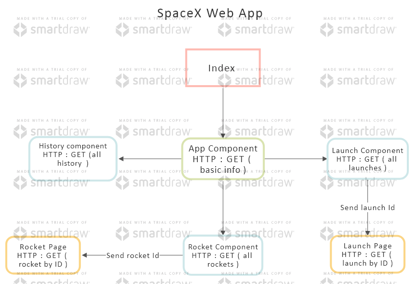

<div align='center'>
  <h2>Version : 1.0.0</h2>
</div>

<div align='center'>
  
</div>

<h1 align='center'>SpaceX - Web App </h1>

Simple spaceX web where you can explore about spacex history , launchs and rockets.

## Table Of Contents

- [General info](#general-info)
  - [Main page](#main-page)
  - [Sub pages](#sub-pages)
  - [Detail pages](#detail-pages)
- [Getting Started](#getting-started)
  - [Prerequisites](#prerequisites)
  - [Installation](#installation)
- [Technologies](#technologies)
  - [Main-Stack](#main-stack)
  - [Libraries](#libraries)
- [Features](#features)
- [Architecture](#architecture) 
- [API](#api)

# General Info

This web has following page of contents:

- Landing Page
  - History
    - Timeline Page
  - Launches
    - List of launches(cards)
      - Launch Deatil page
  - Rockets
    - List of rockets(cards)
      - Rocket Deatil page

# Main Pages <a name='main-page'></a>

### Home Page

in this page displayed basic informtaion about spaceX.

# Sub Pages <a name='sub-pages'></a>

### History

This page has spacex historical events deatils. <br />
Displayed Deatils : Name of historical event , year , description and link to article.<br />
Feature : page has ScrollDown and ScrollUp buttons with ease transition.

### Launches

This page contains list of all launches that was organised by spaceX. <br />
Displayed Deatils : Name , deacription , date and link to view full deatils about launch.<br />
Feature : added simple search , pagination and scrollDown button.<br />

### Rockets

This page contains list of rocket cards where each card with will show details about rocket.<br />
Displayed Deatils : Name, image ,sort deacription , date , and link to view full deatils.<br />
Feature : added simple filter (by name).

# Detail Pages <a name='detail-pages'></a>

### Launch Deatil page

This page displays detailed information about each launch like overview ,rocket Info , link to know about rocket,<br />
1st stage and 2nd stage details, launch site , launch ship and links to social media (To know more about launch).

### Rocket Deatil page

This page displays detailed information about each rocket like overview , engine , payload , thrust level , 1st and 2nd stage deatils.<br />
It has image slider abut the rockets.

# Getting Started <a name="getting-started"></a>

To get a local copy up and running follow these simple steps.

## Prerequisites <a name="prerequisites"></a>

This is an example of how to list things you need to use the software and how to install them.

npm

```javascript
npm install
```

above command you will get installed all the dependencies to run this project locally

## Installation <a name="installation"></a>

(i).Clone the repo

```javascript
git clone https://github.com/github_username/repo_name.git
```

(ii).Install NPM packages

```javascript
npm start
```

(iii).Visit App <br />
http://localhost:3000/

# Technologies <a name="technologies"></a>

## Main Stack <br /> <a name='main-stack'></a>

ReactJS - JavaScript library that is used for building user interfaces specifically for single-page <br />
CSS - Cascading Style Sheets (CSS) is a style sheet language used for describing the presentation of a document. <br />

## Libraries <br /> <a name='libraries'></a>

React-Router-Dom - Used to navigate the user to requested page without loading the web browser. 
Axios - It used to fetch data from the server with ease.<br />
Lodash - Used some util function from this library.<br />
Moment - It helps to get a better version of Date.<br />

# Features <a name='features'></a>

- To Get to know about spacex or you wish to view whenever you want **_You can install this as native app_**
- This supports **PWD** ( progressive web application ) which you can install it as native andriod app.


# Architecture <a name='architecture'></a>

find the component architecture design for this project :
<div align='center'>
  
</div>

# API <a name='api'></a>

This web application uses open source and public API provided by SPACEX.

Visit here => [SpaceX API](https://docs.spacexdata.com/) <br />
This app consumes multiple API endpoints from this public API.
